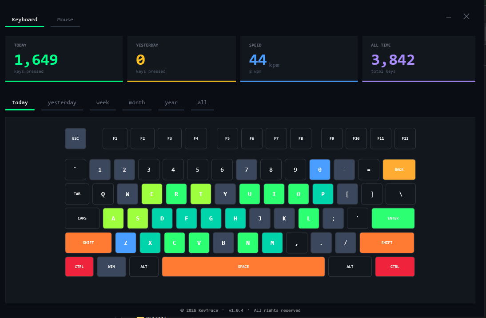

# KeyTrace: Keyboard & Mouse Analytics

  

**KeyTrace** is a comprehensive solution for monitoring and visualizing your peripheral activity. It transforms raw input data into an intuitive, color-coded **Heatmap**, allowing you to analyze your typing habits and mouse usage over different periods.

---

## Setup: Running the Logger in Background

To ensure accurate statistics, `ServiceApp.exe` should run continuously.

### Option 1: The Startup Folder (Quickest)
1. Press `Win + R`, type `shell:startup`, and hit **Enter**.
2. Create a shortcut to `ServiceApp.exe` in this folder.
3. The logger will now start automatically every time you log into Windows.

### Option 2: Task Scheduler (Recommended)
1. Search for **Task Scheduler** in the Start menu.
2. Create a Basic Task named `KeyTraceLogger`.
3. Set the trigger to **"When I log on"**.
4. Set the action to **"Start a program"** and select `ServiceApp.exe`.

---

## Data Storage
Your data is kept private and stored locally on your machine:
`%AppData%\Roaming\KeyrLogs`

---

## ⚠️ Security Notice
This software is intended for **personal productivity analysis only**. Because this tool records keystrokes, it can capture sensitive information. Use this responsibly and strictly for personal data analysis.
